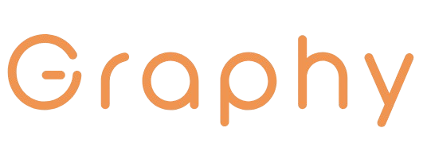
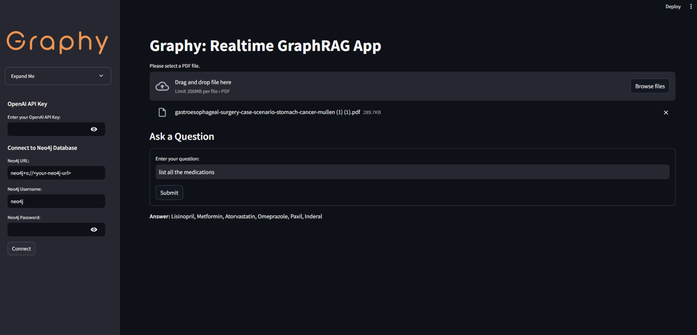

# Graphy v1



Graphy v1 is a real-time GraphRAG (Graph Retrieval-Augmented Generation) application that leverages the power of [LangChain](https://python.langchain.com/), [Neo4j](https://neo4j.com/), and OpenAI's GPT models to extract knowledge from documents and enable natural language querying over a graph database.



## Table of Contents

- [Overview](#overview)
- [Features](#features)
- [Demo](#demo)
- [Getting Started](#getting-started)
  - [Prerequisites](#prerequisites)
  - [Installation](#installation)
  - [Usage](#usage)
- [Contributing](#contributing)
- [License](#license)
- [Contact](#contact)

## Overview

Graphy v1 allows users to upload a PDF document, which is then processed to extract entities and relationships using OpenAI's GPT models (e.g., `gpt-4o` and `text-ada-002`). The extracted information is stored in a Neo4j graph database. Users can then interact with the graph in real-time by asking natural language questions, which are converted into Cypher queries to retrieve answers from the graph.

## Features

- **Real-time GraphRAG**: Extracts knowledge from documents and allows real-time querying.
- **Modular and Configurable**: Users can set their own credentials for OpenAI and Neo4j.
- **Natural Language Interface**: Ask questions in plain English and get answers from the graph database.
- **Visualization**: (Coming Soon) Visual representation of the graph and query results.
- **Extensible**: Designed to support multiple documents and more conversational interactions in future versions.

## Demo

[](https://youtu.be/odtGLUPXqfs)


*Click the image above to watch the demo video on YouTube.*

## Getting Started

### Prerequisites

- Python 3.10 or higher
- An OpenAI API key with access to GPT models (e.g., `gpt-4o` or `ada 002`)
- A Neo4j database instance (local or remote)
- [Streamlit](https://streamlit.io/)

### Installation

1. **Clone the Repository**

   ```bash
   git clone https://github.com/yourusername/graphy-v1.git
   cd graphy-v1
   ```

2. **Install Dependencies**

   Create a virtual environment (optional but recommended):

   ```bash
   python -m venv venv
   source venv/bin/activate  # On Windows, use `venv\Scripts\activate`
   ```

   Install the required packages:

   ```bash
   pip install -r requirements.txt
   ```

### Usage

1. **Set Up Credentials**

   - Place your OpenAI API key and Neo4j credentials in a `.env` file or enter them directly in the app's sidebar when running.

   Example `.env` file:

   ```env
   OPENAI_API_KEY=your-openai-api-key
   NEO4J_URL=neo4j+s://your-neo4j-url
   NEO4J_USERNAME=your-username
   NEO4J_PASSWORD=your-password
   ```

2. **Run the App**

   ```bash
   streamlit run app.py
   ```

3. **Interact with the App**

   - Upload a PDF file using the file uploader.
   - Once the document is processed, ask questions in the provided text input field.
   - View the generated Cypher query and the answer retrieved from the graph.

## Contributing

Contributions are welcome! Here are some ways you can help:

- **Enhancements**: Make the app more conversational or extend it to support multiple documents.
- **Bug Reports**: Submit issues for any bugs you encounter.
- **Feature Requests**: Suggest new features or improvements.
- **Documentation**: Improve documentation and tutorials.

To contribute:

1. Fork the repository.
2. Create a new branch for your feature or bugfix.
3. Commit your changes with clear commit messages.
4. Open a pull request describing your changes.

## License

This project is licensed under the MIT License. See the [LICENSE](./LICENSE) file for details.

## Contact

For questions or inquiries, please contact the developer:

- **Email**: [aianytime07@gmail.com](mailto:aianytime07@gmail.com)

---

*Disclaimer: This project is for educational purposes. Please ensure compliance with all applicable laws and regulations when using OpenAI's API and handling data.*
